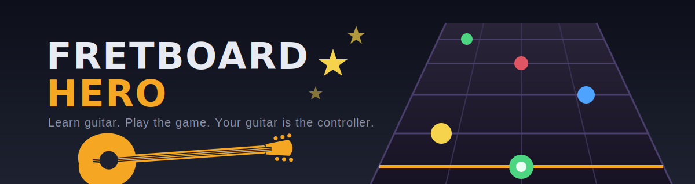

# 🎸 Fretboard Hero

A gamified guitar practice web app for beginners — your guitar is the controller. Inspired by Yousician.

Learn where every note lives on the fretboard by playing them on a real guitar. The app listens through your microphone, detects the pitch you play, and scores you in real time.

## Features

- **Real-time pitch detection** — Web Audio API + autocorrelation (ACF2+), no server or install needed
- **8 progressive levels** — open strings → each string (frets 0–5) → full-board mix
- **Scoring & streaks** — speed bonuses, streak multipliers (up to 2×), 1–3 stars per level
- **Level unlocking** — earn at least 1 star (50%+ accuracy) to unlock the next level
- **Built-in tuner** — live note + cents display, doubles as a guitar tuner
- **Practice options** — toggle fret hints off once confident; relaxed 15s timer mode
- **Progress saved** — stars persist in your browser via localStorage

## Getting Started

The app is a single HTML file with no dependencies.

### Option 1: One-click launcher (macOS, recommended)

Double-click `start.command` — it starts a local server and opens the game at
<http://localhost:8000>. Leave the Terminal window open while playing.
(First time: if macOS blocks it, right-click → Open. If needed, run
`chmod +x start.command` once.)

### Option 2: Safari direct

Open `index.html` directly in Safari — it allows microphone access on local files.
Note: progress is stored per origin, so pick one option and stick with it
(or use Export/Import on the Progress screen to move your data).

### Option 3: Manual local server

```bash
python3 -m http.server 8000
```

Then visit <http://localhost:8000>. (Chrome blocks the mic on `file://` URLs,
so a server is required for Chrome.)

> **macOS note:** if you get a mic error (`AbortError`), enable your browser under
> **System Settings → Privacy & Security → Microphone**, then fully restart the browser.
> Also close other apps that may hold the mic (Zoom, FaceTime, etc.).

## How to Play

1. Tune your guitar (the tuner at the bottom of the game screen works for this)
2. Pick a level — you'll be shown a note name and which string to play it on
3. Play the note cleanly near your mic before the timer runs out
4. Faster answers and streaks earn more points; 90%+ accuracy = 3 stars

## Tech

Single-file vanilla HTML/CSS/JS. Pitch detection runs an autocorrelation with parabolic
interpolation over a 4096-sample mic buffer; a note counts as hit after 5 consecutive
matching frames (pitch class match, octave-error tolerant). SVG fretboard rendering.

## Roadmap

- [x] Chord practice (Em, Am, D, G, C): string-by-string learn mode + strummed chord-change drills
- [ ] Scrolling "Guitar Hero"-style song mode
- [ ] Metronome / strumming rhythm trainer
- [ ] Higher frets (5–12) and full fretboard levels

## License

MIT
